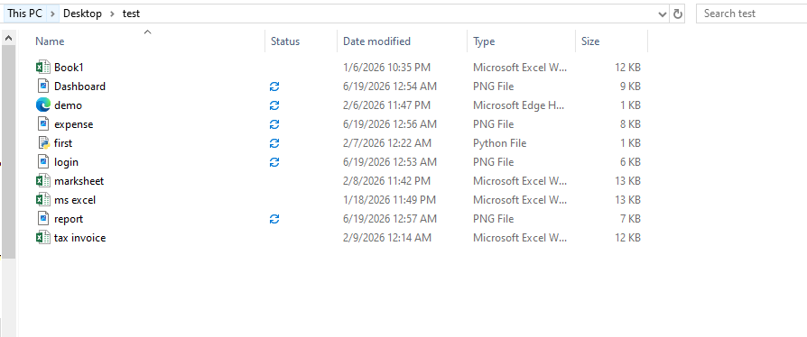
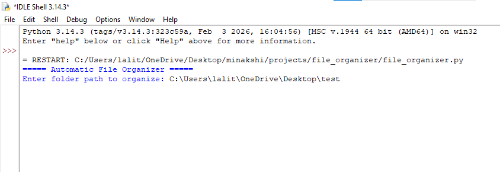
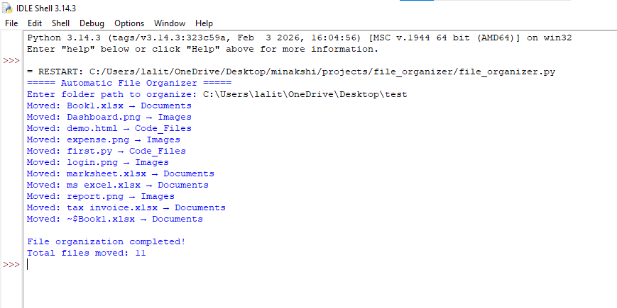
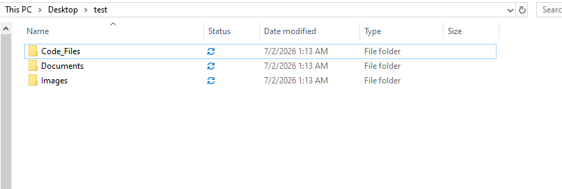

# 📂 Automatic File Organizer

A simple Python automation script that organizes files into different folders based on their file extensions. This project helps keep folders clean and well-structured by automatically sorting files into categories such as Images, Documents, Videos, Audio, Code Files, Compressed Files, and Others.

---

## 📖 Project Description

Managing a folder with many different types of files can be time-consuming. This Python script automates the process by scanning a selected folder, identifying each file based on its extension, creating category folders if they do not already exist, and moving the files into the appropriate folders.

This project is developed as part of the **CodeAlpha Python Programming Internship - Task 3 (Task Automation with Python Scripts).**

---

## ✨ Features

- 📁 Automatically organizes files by type
- 🖼️ Supports image files
- 📄 Supports document files
- 🎥 Supports video files
- 🎵 Supports audio files
- 💻 Supports programming files
- 📦 Supports ZIP and compressed files
- 📂 Creates folders automatically if they don't exist
- 🔄 Prevents overwriting duplicate file names
- 🖥️ Simple command-line interface

---

## 🛠️ Technologies Used

- Python 3
- os module
- shutil module

---

## 📂 Project Structure

```
CodeAlpha_FileOrganizer/
│
├── file_organizer.py
├── README.md
├── LICENSE
└── screenshots/
    ├── before.png
    ├── after.png
    └── terminal.png
```

---

## 📦 Supported File Types

| Category | Extensions |
|----------|------------|
| Images | .jpg, .jpeg, .png, .gif, .webp |
| Documents | .pdf, .doc, .docx, .txt, .pptx, .xlsx |
| Videos | .mp4, .avi, .mkv, .mov |
| Audio | .mp3, .wav, .aac |
| Code Files | .py, .html, .css, .js, .java, .cpp, .c |
| Compressed | .zip, .rar, .7z |
| Others | All remaining file types |

---

## 🚀 Installation

1. Clone the repository

```bash
git clone https://github.com/YourUsername/CodeAlpha_FileOrganizer.git
```

2. Navigate to the project folder

```bash
cd CodeAlpha_FileOrganizer
```

3. Run the script

```bash
python file_organizer.py
```

---

## ▶️ Usage

1. Run the program.
2. Enter the folder path you want to organize.
3. The script will:
   - Scan all files.
   - Create folders if needed.
   - Move files into their respective folders.
4. A success message will be displayed after completion.

---

## 📸 Screenshots

### Before Organizing



### Terminal Input



### Terminal Output



### After Organizing



---

## 💡 Future Improvements

- Add a graphical user interface (GUI)
- Allow users to customize categories
- Add file logging
- Add undo functionality
- Monitor folders automatically in real-time

---

## 🎯 Learning Outcomes

This project helped me understand:

- Python file handling
- Working with directories
- os module
- shutil module
- Functions
- Conditional statements
- Loops
- Automation using Python

---

## 👩‍💻 Author

**Minakshi Sharma**

BCA Student | Python Learner

GitHub: https://github.com/minakshi3097sharma-cloud

LinkedIn: https://linkedin.com/in/minakshi-sharma-1a4969300

---

## 📄 License

This project is licensed under the MIT License.

---

⭐ If you found this project useful, consider giving it a star on GitHub!
